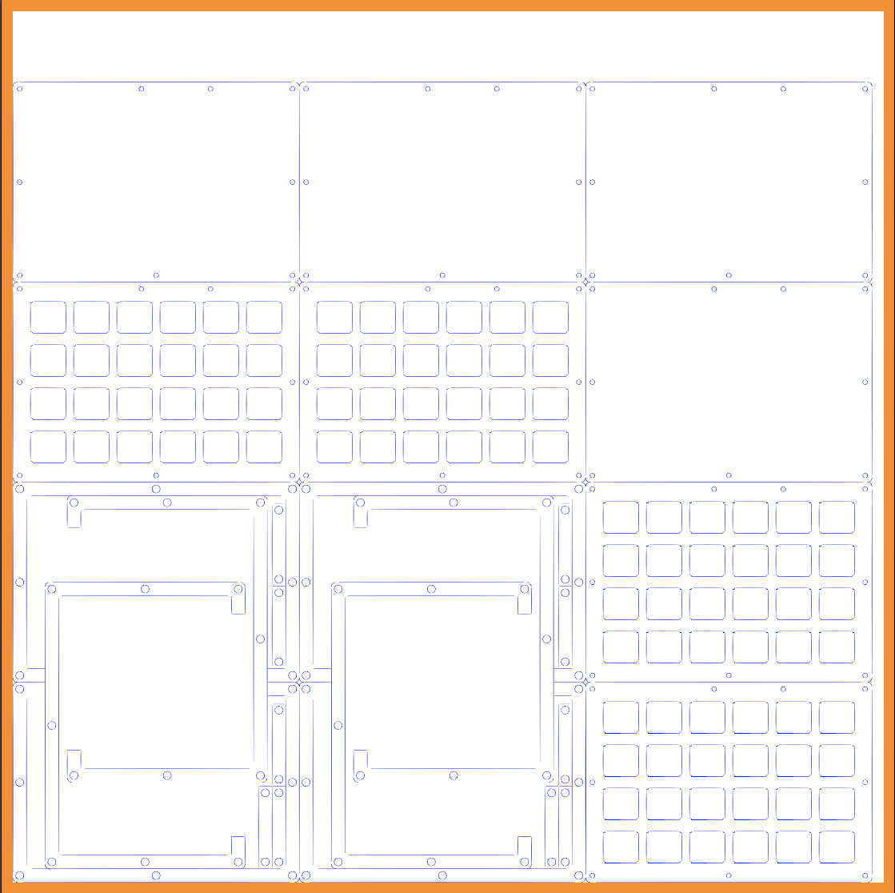

Let's Split V2 and Levinson Case
================================

Here's case design files for the Let's Split V2 and Levinson. It's a sandwich-style case with cutouts at the back to accommodate the USB jack and the TRRS jack.

The design file has 4 top and bottom pieces and 8 middle layer pieces. This is only good for 1 whole case for 2 halves, and 1 case that has no middle layers (you'd need to use standoffs).

Pieces
------
There's 4 different types of pieces the case uses:

- Top/Switch layer - Each half uses 1 of these
- Bottom layer - Each half uses 1 of these
- Middle layer
    - C-shaped piece - Each half uses 3 of these, use a 4th one if you need more space (like when using a Pro Micro with Mini USB jack)
    - Stick piece - Same number as the C-Shaped piece

Screws and Standoffs
--------------------
This case was designed to use M2 screws and standoffs. The holes in the middle layers are for the standoffs, while the holes in the top and bottom layers are only wide enough for the screws. M2 screws and standoffs that fit the case can be purchased at Keebio: [M2 Screws & Standoffs](https://keeb.io/products/m2-screws-and-standoffs).

### Sculpteo
[Sculpteo](https://www.sculpteo.com) offers laser cutting services and is relatively easy to use.

Steps:
- Upload file
- Scale the object correctly, the dimensions of the plates are 126.3mm x 88.2mm
- Make sure all colors are set to "Cut" and not any of the engraving choices
- Select your material and order

### Ponoko
To have the case made with Ponoko, you can't take these files as is and send them off to them. First, you'll need to download the templates for P1, P2, & P3 sheets from here, depending on what vector editor you are using:

- [Inkscape templates](https://www.ponoko.com/starter-kits/inkscape)
- [Adobe Illustrator template](https://www.ponoko.com/starter-kits/adobe-illustrator)
- [Other](https://www.ponoko.com/make-and-sell/design-it-yourself)

Next, open up the template of the sheet size you want and open up the case design files as well. Then, copy the drawings in the case design files into the template. Remove any overlapping lines to reduce the cutting cost using this guide: [Avoid doubled up lines](http://support.ponoko.com/hc/en-us/articles/220289608-Avoid-doubled-up-blue-cutting-lines-in-your-designs).

### Middle Layer Thickness
If you're having the middle layers made, from the top of the switch plate to the top of the bottom plate, the minimium distance between the two required is 12mm if the plastic on the header pins is removed. The requirement is slightly more (about 13.5mm) if you leave the plastic on. Therefore, the following middle layer thickness are needed based on the thickness of the switch layer:

- 1.5mm Stainless steel switch plate: 10.5mm
    - Usually accomplished with:
        - 2x4.5mm + 1x1.5mm layers
        - or 3x3mm + 1x1.5mm layers
        - or 4x3mm layers
- 3mm acrylic switch plate: 9mm
    - Usually accomplished with:
        - 2x4.5mm layers
        - or 3x3mm layers

Case Images
-------------

### SVG file

### Assembled case

License
-------
These case files are released under the MIT License.
